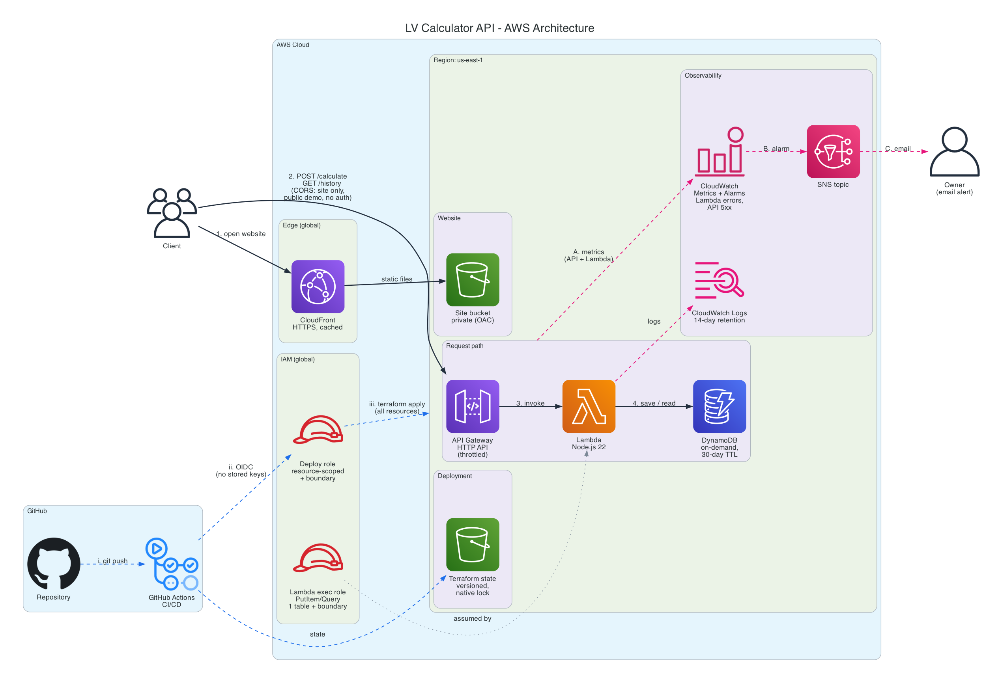

# lv-calculator-api

[](https://github.com/wajih2411/lv-calculator-api/actions/workflows/deploy.yml)

**Live demo:** https://d2uobnkpu5jtt4.cloudfront.net

A serverless API and website (the Camera Infrastructure Calculator) that sizes a low-voltage camera system, deployed to AWS with Terraform and GitHub Actions.

## What it does

Give it a camera count, resolution and retention period, and it estimates the network bandwidth, recording storage, PoE power load, heat load in BTU/hr and UPS runtime for the system. Every calculation is saved and can be retrieved later through a history endpoint.

The Camera Infrastructure Calculator is a web interface to the same API: it runs calculations and shows the history in the browser.

## Architecture



Diagram generated from code with the Python `diagrams` library (`docs/architecture.py`).

## Tech stack

- **Runtime:** Node.js 22 on AWS Lambda (arm64)
- **API:** API Gateway HTTP API
- **Data:** DynamoDB, on-demand, with TTL
- **Frontend:** HTML/CSS/JS with Motion animations, on S3 + CloudFront (Origin Access Control)
- **Monitoring:** CloudWatch Logs and Alarms, SNS email
- **Infrastructure as code:** Terraform, state in S3
- **CI/CD:** GitHub Actions with OIDC
- **Tests:** Jest

## Design decisions

- **Serverless instead of EC2.** Lambda bills per request and there are no servers to patch or keep running for an API that is idle most of the time.
- **HTTP API instead of REST API.** It is simpler and cheaper, and this project needs none of the REST API extras.
- **DynamoDB on-demand with TTL.** There is no capacity to plan, and DynamoDB deletes each item itself after 30 days, so there is no cleanup job.
- **Single partition key.** All calculations share one partition, sorted by time, which makes "most recent" a single query. That is fine at this scale; a high-traffic version would spread writes across several keys.
- **Math separate from the handler.** The formulas live in `src/calculator.js` with no AWS code, so they are tested without mocks or an AWS account.
- **400 versus 500.** Bad input raises a `ValidationError` and returns a 400 that says what to fix. Anything else is logged to CloudWatch and returns a generic 500, so internals never leak.
- **OIDC instead of access keys.** GitHub Actions gets short-lived credentials for each run, so there is no long-lived key to leak or rotate.
- **Permissions boundary.** The deploy role can only create IAM roles capped by a boundary policy, so it cannot grant itself or the app more access than the app needs.
- **S3 remote state with native locking.** CI and local runs share one state file, and two applies cannot run at once.
- **Cost controls.** API throttling (5 requests/second, burst of 10) limits abuse, and logs expire after 14 days.
- **Private site bucket behind CloudFront (OAC).** The S3 bucket is private and Origin Access Control lets only CloudFront read the site files. CloudFront serves them over HTTPS with managed security headers.
- **CORS limited to the site.** The API only allows the CloudFront origin, so browsers on other sites can't call it.

## API

### POST /calculate

```sh
curl -X POST "$(terraform -chdir=terraform output -raw calculate_endpoint)" \
  -H 'Content-Type: application/json' \
  -d '{"cameraCount": 10, "resolution": "1080p", "retentionDays": 30, "additionalLoadWatts": 50, "upsBatteryWh": 1000}'
```

```json
{
  "inputs": {
    "cameraCount": 10,
    "resolution": "1080p",
    "retentionDays": 30,
    "recordingHoursPerDay": 24,
    "wattsPerCamera": 12.95,
    "additionalLoadWatts": 50,
    "upsBatteryWh": 1000,
    "upsEfficiency": 0.9
  },
  "bitratePerCameraMbps": 4,
  "totalBandwidthMbps": 40,
  "storageTB": 12.96,
  "totalLoadWatts": 179.5,
  "heatLoadBtuPerHour": 612.5,
  "upsRuntimeMinutes": 300.8
}
```

Only `cameraCount`, `resolution` and `retentionDays` are required. `upsRuntimeMinutes` is `null` unless `upsBatteryWh` is given.

The response also includes an `id` and `createdAt`: every calculation is saved to DynamoDB and deleted automatically after 30 days.

| Field | Required | Default | Notes |
|---|---|---|---|
| `cameraCount` | yes | | Whole number, at least 1 |
| `resolution` | yes | | `1080p`, `4MP`, `5MP` or `4K` |
| `retentionDays` | yes | | Greater than 0 |
| `recordingHoursPerDay` | no | 24 | Up to 24 |
| `wattsPerCamera` | no | 12.95 | PoE (802.3af) maximum at the camera |
| `additionalLoadWatts` | no | 0 | Switches, recorder and other equipment |
| `upsBatteryWh` | no | | Enables the UPS runtime estimate |
| `upsEfficiency` | no | 0.9 | Between 0 and 1 |

### GET /history

Returns the most recent calculations, newest first. The optional `?limit=` accepts 1-50 (default 10).

```sh
curl "$(terraform -chdir=terraform output -raw history_endpoint)?limit=5"
```

```json
{
  "count": 1,
  "items": [
    {
      "id": "3f2b8c1e-5d47-4a90-9c1b-7e6a2d4f8b10",
      "createdAt": "2026-01-01T00:00:00.000Z",
      "result": { "storageTB": 12.96, "totalBandwidthMbps": 40 }
    }
  ]
}
```

`result` holds the full calculation output (shortened here).

## Install

Prerequisites:

- Node.js (with npm)
- Terraform 1.10 or later
- AWS CLI, configured (`aws configure`)
- An AWS account

The first time, create the shared infrastructure (see [CI/CD](#cicd)) and set the alert address (see [Monitoring](#monitoring)). S3 bucket names are global, so in your own account change the bucket name in `bootstrap/variables.tf` and `terraform/providers.tf` first.

```sh
./scripts/install.sh
```

This checks prerequisites, runs the tests, deploys to AWS, and prints the endpoint. Terraform asks for confirmation before deploying; pass `--auto-approve` to skip it.

## Uninstall

```sh
./scripts/uninstall.sh
```

This deletes all AWS resources for this project (Terraform asks for confirmation; `--auto-approve` skips it). Add `--clean` to also remove local files (`node_modules`, `terraform/.terraform`, `terraform/build`) after a successful destroy.

## CI/CD

GitHub Actions (`.github/workflows/deploy.yml`) runs on every pull request and every push to `main`:

- **Pull requests** run the unit tests and `terraform fmt` / `terraform validate`. They never touch AWS.
- **Pushes to `main`** run the same checks, then deploy with Terraform and smoke-test the live endpoint.

The deploy job authenticates to AWS with OIDC, so no access keys are stored in GitHub. It assumes a resource-scoped deploy role that can only manage this project's resources, and only workflows on the `main` branch of this repo can assume it. The role's ARN is stored as the `AWS_ROLE_ARN` repository secret.

Terraform state lives in an S3 bucket with S3-native locking, so GitHub Actions and local runs share one state and can't apply at the same time.

The `bootstrap/` folder creates what the pipeline depends on: the state bucket, the GitHub OIDC provider, the deploy role, and the permissions boundary that caps what the app's own IAM roles can do. Run it once, locally, with your own AWS credentials:

```sh
terraform -chdir=bootstrap init
terraform -chdir=bootstrap apply
```

## Monitoring

Two CloudWatch alarms watch the live API:

- **Lambda errors**: the function crashed or timed out.
- **API 5xx**: the API returned a server error.

Both notify an SNS topic that emails the owner when an alarm fires and again when it clears. AWS sends a confirmation email to the address first; alerts only arrive after the link in it is clicked.

The address comes from the `ALERT_EMAIL` GitHub secret in CI. When running Terraform locally, set it yourself:

```sh
export TF_VAR_alert_email="you@example.com"
```

## Running tests

```sh
npm test
```

The tests mock DynamoDB, so they need no AWS account or network access.

## Cost

At hobby traffic this runs within or near the AWS free tier:

- **Lambda and API Gateway** are pay-per-request, so an idle API costs nothing.
- **DynamoDB** is on-demand, billed per read and write, and TTL keeps the table small.
- **S3 state** is a single small file, costing cents per month.
- **The website** uses CloudFront and a small S3 bucket, which fall within or near the free tier at demo traffic: CloudFront's always-free tier covers far more traffic than this site gets, and S3 storage for a few small files costs pennies.

## Known limitations & future work

- **No authentication.** Anyone with the URL can call the API and read the history. Next: API keys or Cognito.
- **Single region.** There is no failover if the region has an outage.
- **Pull requests don't run `terraform plan` against AWS.** Next: a read-only plan role for PRs.
- **Rule-of-thumb bitrates.** Calculations use typical H.264 values per resolution, not vendor-specific figures.
- **Account-wide CloudFront permissions.** The deploy role has `cloudfront:*` on all distributions, because distributions get random IDs and can't be scoped by name.
